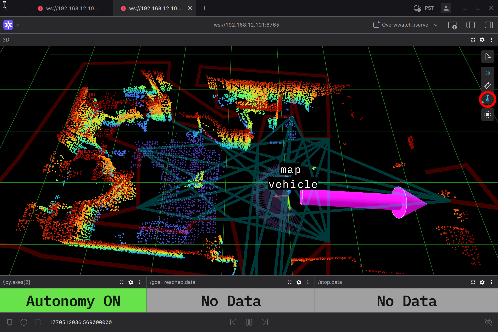

# nav-autonomy-deploy

Docker-based deployment system for autonomous navigation on robotic platforms. Orchestrates containerized ROS 2 services for real-time navigation, LiDAR-based SLAM, and remote monitoring.

## Overview

This repository provides deployment configurations and scripts to run the iServe Robotics navigation stack via Docker Compose.

- **nav_autonomy** -- Core navigation stack including SLAM, path planning, localization, and robot control

## Architecture

```
┌──────────────────────────────────────┐
│            Host Machine              │
│                                      │
│  ┌────────────────────────────────┐  │
│  │  nav_autonomy                  │  │
│  │                                │  │
│  │  - FASTLIO2 SLAM               │  │
│  │  - Route Planner               │  │
│  │  - ICP Localizer               │  │
│  │  - Twist Relay                 │  │
│  │  - Goal Relay                  │  │
│  │  - Foxglove (:8765)            │  │
│  └────────────────────────────────┘  │
│                                      │
│    Volumes: maps/ , logs/            │
└──────────────────────────────────────┘
```

## Prerequisites

- Docker & Docker Compose (v1.29+)
- Linux host with network namespace support
- Mid-360 LiDAR (or compatible)
- Motor controller (serial)
- Optional: NVIDIA GPU with CUDA runtime
- Optional: Unitree Go2/G1 robot
- Optional: X11 server (for RViz visualization)

## Quick Start

### 1. Configure Hardware

Copy the environment template and customize for your hardware:

```bash
cp env.txt .env
```

Edit `.env` with your hardware details:

| Variable | Description | Default |
|----------|-------------|---------|
| `ROS_DOMAIN_ID` | ROS 2 domain for multi-robot isolation | `42` |
| `ROBOT_CONFIG_PATH` | Robot model config path | `unitree/unitree_go2` |
| `LIDAR_INTERFACE` | Network interface for LiDAR | `enP8p1s0` |
| `LIDAR_IP` | LiDAR device IP | `192.168.1.1xx` |
| `LIDAR_COMPUTER_IP` | Processing computer IP | `192.168.1.xxx` |
| `USE_UNITREE` | Enable Unitree robot control | `false` |
| `UNITREE_IP` | Unitree robot IP | `192.168.12.1` |
| `DOCKER_RUNTIME` | Container runtime (`runc` or `nvidia`) | `runc` |
| `MAP_PATH` | Pre-built map for localization (empty = mapping mode) | `` |

### 2. Start Navigation Stack

```bash
docker compose up -d                        # Default: jazzy, detached
IMAGE_TAG=humble docker compose up -d       # Use ROS 2 Humble
docker compose logs -f                      # View logs
docker compose down                         # Stop
```

**Fallback (without Docker Compose):**

If Docker Compose is not available, use the standalone script:

```bash
./run.sh              # Default: jazzy
./run.sh --humble     # Use ROS 2 Humble
./run.sh --jazzy -d   # Jazzy, detached mode
```

> **Note (Jetson G1):** To install the Docker Compose plugin without updating JetPack:
> ```bash
> curl -SL https://github.com/docker/compose/releases/latest/download/docker-compose-linux-aarch64 -o ~/.docker/cli-plugins/docker-compose && chmod +x ~/.docker/cli-plugins/docker-compose
> ```

### 3. Connect Visualization

Connect [Foxglove](https://foxglove.dev/) to the robot for remote monitoring:

- **Navigation**: `ws://<robot-ip>:8765`

Import `Overwwatch.json` into Foxglove for a pre-configured layout with 3D terrain view, autonomy status, and path visualization.

To send a goal pose, click the **Publish** button ( ⬆ ) on the right toolbar of the 3D panel (highlighted in red below), then click on the map: the first click sets the position (x, y), and the second click sets the heading.



## Project Structure

```
.
├── docker-compose.yml          # Nav autonomy container orchestration
├── run.sh                      # Launch script for nav_autonomy
├── .env                        # Hardware configuration (from env.txt)
├── env.txt                     # Environment variable template
├── Overwwatch.json             # Foxglove visualization layout
├── maps/                       # Stored map PCD files
└── logs/                       # Runtime logs
```


